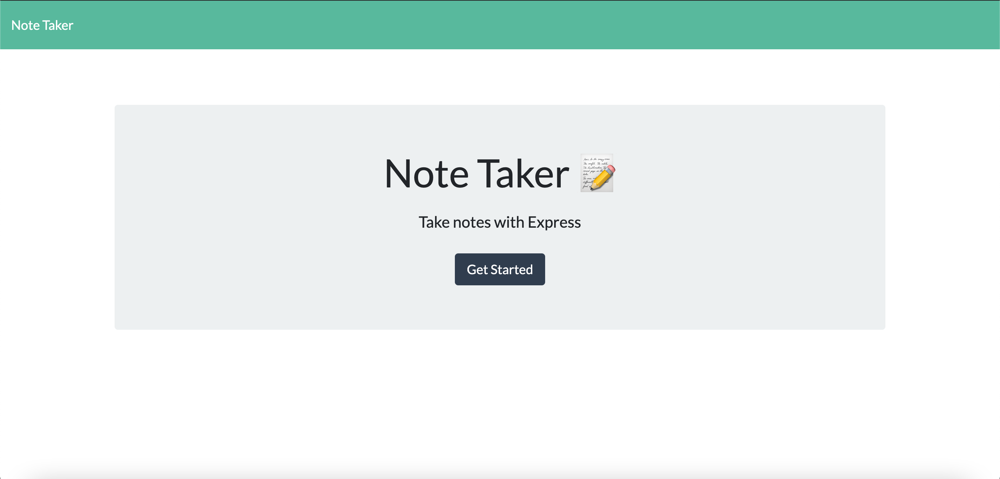

# Note Taker
  ## Licensing:
  
  ## Table of Contents 
  - [Description](#description)
  - [Installation](#installation)
  - [Contribution](#contribution)
  - [Testing](#testing)
  - [Questions?](#questions)
  ## Description:
  This note taking application allows the user to write and save notes. Notes are listed on the left hand side and can be accessed or deleted. This project uses express.js backend and is deployed through heroku.
  
  
  
  ## Installation:
  [Note Taker](https://thangsnotetaker.herokuapp.com/)
  ## License:
  
  Copyright © Thang Nguyen. All rights reserved. 
  Licensed under the [MIT](https://opensource.org/licenses/MIT) license.
  ## Contribution:
  Anyone can contribute.
  ## Testing:
  Run through the deployed link.
  ## Questions?
  - Github: [thangnt336](https://github.com/thangnt336)
  - Email: thangnt336@gmail.com 
